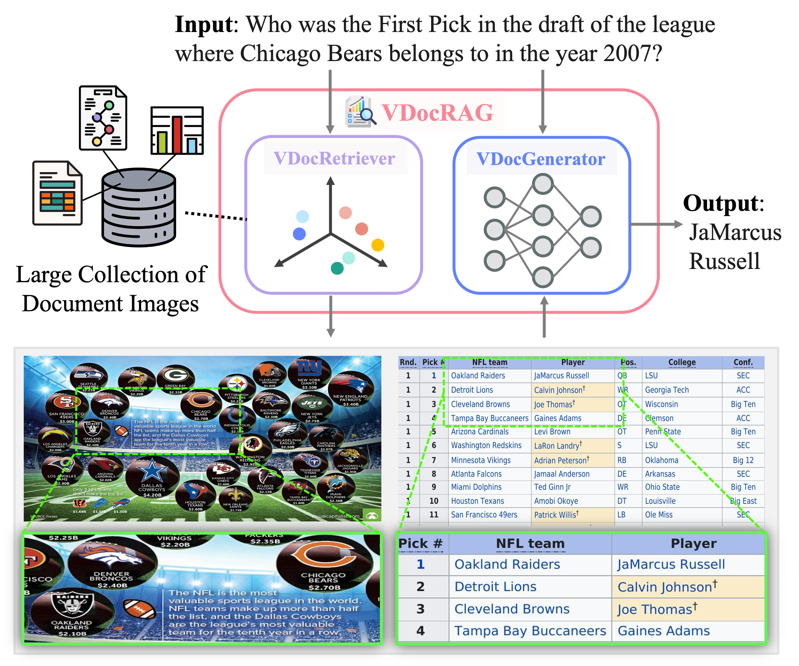

<div align="center">

# VDocRAG: Retirval-Augmented Generation over Visually-Rich Documents

[](https://vdocrag.github.io/)
[](http://arxiv.org/abs/2504.09795)
[](https://huggingface.co/NTT-hil-insight/VDocRetriever-Phi3-vision)
[](https://huggingface.co/NTT-hil-insight/VDocGenerator-Phi3-vision)
[](https://huggingface.co/datasets/NTT-hil-insight/OpenDocVQA)
[](https://huggingface.co/datasets/NTT-hil-insight/OpenDocVQA-Corpus)
[](https://cvpr.thecvf.com/)
</div>

This repository includes the VDocRAG introduced by the following paper: Ryota Tanaka, Taichi Iki, Taku Hasegawa, Kyosuke Nishida, Kuniko Saito, and Jun Suzuki. [VDocRAG: Retirval-Augmented Generation over Visually-Rich Documents](http://arxiv.org/abs/2504.09795). In Proc. of CVPR 2025.


**VDocRAG** is a new RAG framework that can directly understand diverse real-world documents purely from visual features. 

**💪 Key Enhancements of VDocRAG:**
- **New Pretraining Tasks:** we propose novel self-supervised pre-training tasks (**RCR** and **RCG**) that adapt large vision-language models for retrieval by compressing visual information into dense token representations while aligning them with textual content in documents. 
- **New Dataset:** we introduce **OpenDocVQA**, the first unified collection of open-domain document visual question answering datasets, encompassing diverse document types and formats.

<div align="center">

</div>

# 📌Contents
- [News](#news)
- [Installation](#installation)
- [Quick Start](#quick_start)
- [Dataset](#dataset)
- [Retriever](#retriever)
- [Generator](#generator)
- [LICENSE](#license)
- [Citation](#citation)
- [Acknowledgement](#acknowledgement)


<a name="news"></a>
# 📢 News
- [2025/04]: The technical report, code, data, and model for VDocRAG are all available online.
- [2025/02]: 🎉 VDocRAG is accepted to CVPR 2025.

<a name="installation"></a>
# ⚙️ Installation
1. Clone the repository.
2. Install PyTorch based on your CUDA version from PyTorch.
3. Install dependencies and VDocRAG.
```bash
pip install -r requirements.txt
pip install -e .
```

<a name="quick_start"></a>
# ⚡️ Quick Start
You can download [VDocRetriever](https://huggingface.co/NTT-hil-insight/VDocRetriever-Phi3-vision) and [VDocGenerator](https://huggingface.co/NTT-hil-insight/VDocGenerator-Phi3-vision) from 🤗 HuggingFace Hub. To get started, first import the libraries as shown below:
```py
from PIL import Image
import requests
from io import BytesIO
from torch.nn.functional import cosine_similarity
import torch
from transformers import AutoProcessor
from vdocrag.vdocretriever.modeling import VDocRetriever
from vdocrag.vdocgenerator.modeling import VDocGenerator
```

## Retrieval 
```py
processor = AutoProcessor.from_pretrained('microsoft/Phi-3-vision-128k-instruct', trust_remote_code=True)
model = VDocRetriever.load('microsoft/Phi-3-vision-128k-instruct', 
                          lora_name_or_path='NTT-hil-insight/VDocRetriever-Phi3-vision', 
                          pooling='eos', 
                          normalize=True,
                          trust_remote_code=True, 
                          attn_implementation="flash_attention_2", 
                          torch_dtype=torch.bfloat16, 
                          use_cache=False).to('cuda:0')

# Process query inputs and get the embeddings
queries = ["Instruct: I’m looking for an image that answers the question.\nQuery: What is the total percentage of Palestinians residing at West Bank?</s>", 
           "Instruct: I’m looking for an image that answers the question.\nQuery: How many international visitors came to Japan in 2017?</s>"]
query_inputs = processor(queries, return_tensors="pt", padding="longest", max_length=256, truncation=True).to('cuda:0')

with torch.no_grad():
    model_output = model(query=query_inputs, use_cache=False)
    query_embeddings = model_output.q_reps

urls = [
    "https://huggingface.co/datasets/NTT-hil-insight/OpenDocVQA/resolve/main/image1.png",
    "https://huggingface.co/datasets/NTT-hil-insight/OpenDocVQA/resolve/main/image2.png"
]

doc_images = [Image.open(BytesIO(requests.get(url).content)).resize((1344, 1344)) for url in urls]

# Process images and get the embeddings
doc_prompt = "<|image_1|>\nWhat is shown in this image?</s>"
collated_list = [
    processor(doc_prompt, images=image, return_tensors="pt", padding="longest", max_length=4096, truncation=True).to('cuda:0') for image in doc_images
]

doc_inputs = {
    key: torch.stack([item[key][0] for item in collated_list], dim=0)
    for key in ['input_ids', 'attention_mask', 'pixel_values', 'image_sizes']
}

with torch.no_grad():
    model_output = model(document=doc_inputs, use_cache=False)
    doc_embeddings = model_output.p_reps

# Calculate cosine similarity
num_queries = query_embeddings.size(0)
num_passages = doc_embeddings.size(0)

for i in range(num_queries):
    query_embedding = query_embeddings[i].unsqueeze(0)
    similarities = cosine_similarity(query_embedding, doc_embeddings)
    print(f"Similarities for Query {i}: {similarities.cpu().float().numpy()}")

# >> Similarities for Query 0: [0.515625   0.38476562]
#    Similarities for Query 1: [0.37890625 0.5703125 ]
```

## Generation
```py
model = VDocGenerator.load('microsoft/Phi-3-vision-128k-instruct', 
                          lora_name_or_path='NTT-hil-insight/VDocGenerator-Phi3-vision', 
                          trust_remote_code=True,
                          attn_implementation="flash_attention_2", 
                          torch_dtype=torch.bfloat16, 
                          use_cache=False).to('cuda:0')

# Process images with the prompt
query =  "How many international visitors came to Japan in 2017? \n Answer briefly."
image_tokens = "\n".join([f"<|image_{i+1}|>" for i in range(len(doc_images))])
messages = [{"role": "user", "content": f"{image_tokens}\n{query}"}]
prompt = processor.tokenizer.apply_chat_template(messages, tokenize=False, add_generation_prompt=True) 
processed = processor(prompt, images=doc_images, return_tensors="pt").to('cuda:0')

# Generate the answer
generate_ids = model.generate(processed, 
                              generation_args={
                                "max_new_tokens": 64, 
                                "temperature": 0.0, 
                                "do_sample": False, 
                                "eos_token_id": processor.tokenizer.eos_token_id
                              })
generate_ids = generate_ids[:, processed['input_ids'].shape[1]:]
response = processor.batch_decode(generate_ids, 
                                  skip_special_tokens=True, 
                                  clean_up_tokenization_spaces=False)[0].strip()

print("Model prediction: {0}".format(response))

# >> Model prediction: 28.69m
```

<a name="dataset"></a>
# 💾 Dataset 
OpenDocVQA is a unified collection of open-domain document visual question answering datasets, encompassing diverse document types and formats. It consists of 9 open-domain DocumentVQA datasets, including a newly created MHDocVQA dataset to address multi-hop questions over multiple documents, and collected and filtered QA datasets (DocVQA, InfoVQA, DUDE, VisulMRC, ChartQA, OpenWikiTable, MPMQA, and SlideVQA). In total, OpenDocVQA contains 43k QA paris with 200k document images.

You can donwload OpenDocVQA dataset from 🤗 HuggingFace Hub as follows:
- [QA Pairs](https://huggingface.co/datasets/NTT-hil-insight/OpenDocVQA)
- [Corpus](https://huggingface.co/datasets/NTT-hil-insight/OpenDocVQA-Corpus)

<a name="retriever"></a>
# 🔎 Retriever

## Pre-training VDocRetriever
This script supports our proposed pre-training tasks, including RCR (Representation Compression via Retrieval) and RCG (Representation Compression via Generation).
```bash
deepspeed --include localhost:0 --master_port 60000 --module vdocrag.vdocretriever.driver.train \
  --deepspeed deepspeed/ds_zero3_config.json \
  --output_dir outputs/vdocretriever-phi3-vision_pretrain \
  --model_name_or_path microsoft/Phi-3-vision-128k-instruct \
  --lora \
  --lora_target_modules q_proj,k_proj,v_proj,o_proj,down_proj,up_proj,gate_proj \
  --save_steps 2000 \
  --dataset_name NTT-hil-insight/VDocRetriever-Pretrain-DocStruct \
  --bf16 \
  --pooling eos \
  --append_eos_token \
  --normalize \
  --temperature 0.01 \
  --per_device_train_batch_size 1 \
  --gradient_checkpointing \
  --train_group_size 1 \
  --learning_rate 1e-4 \
  --query_max_len 512 \
  --answer_max_len 512 \
  --num_train_epochs 1 \
  --logging_steps 10 \
  --overwrite_output_dir \
  --gradient_accumulation_steps 4 \
  --pretrain \
  --image_attention_mask \
  --report_to wandb \
```

## Fine-tuning VDocRetriever
```bash
deepspeed --include localhost:0 --master_port 60000 --module vdocrag.vdocretriever.driver.train \
  --deepspeed deepspeed/ds_zero3_config.json \
  --output_dir outputs/vdocretriever-phi3-vision_finetune \
  --model_name_or_path microsoft/Phi-3-vision-128k-instruct \
  --lora_name_or_path outputs/vdocretriever-phi3-vision_pretrain \
  --lora \
  --lora_target_modules q_proj,k_proj,v_proj,o_proj,down_proj,up_proj,gate_proj \
  --save_steps 2000 \
  --dataset_name NTT-hil-insight/OpenDocVQA \
  --corpus_name NTT-hil-insight/OpenDocVQA-Corpus \
  --bf16 \
  --pooling eos \
  --append_eos_token \
  --normalize \
  --temperature 0.01 \
  --per_device_train_batch_size 4 \
  --gradient_checkpointing \
  --train_group_size 1 \
  --learning_rate 1e-4 \
  --query_max_len 256 \
  --answer_max_len 256 \
  --num_train_epochs 1 \
  --logging_steps 10 \
  --overwrite_output_dir \
  --gradient_accumulation_steps 4 \
  --report_to wandb \
```

## Query encoding
If you want to use our fine-tuned model directly, `lora_name_or_path` is set to `NTT-hil-insight/VDocRetriever-Phi3-vision`. `QUERY_DATASET` must be selected from the following options: {chartqa, slidevqa, infovqa, dude}

```bash
CUDA_VISIBLE_DEVICES=0 python -m vdocrag.vdocretriever.driver.encode \
  --output_dir=temp \
  --model_name_or_path microsoft/Phi-3-vision-128k-instruct \
  --lora_name_or_path outputs/vdocretriever-phi3-vision_finetune \
  --lora \
  --bf16 \
  --pooling eos \
  --append_eos_token \
  --normalize \
  --encode_is_query \
  --per_device_eval_batch_size 24 \
  --query_max_len 256 \
  --dataset_name NTT-hil-insight/OpenDocVQA \
  --dataset_config $QUERY_DATASET \
  --dataset_split test \
  --encode_output_path $EMBEDDING_OUTPUT_DIR/query-${QUERY_DATASET}.pkl
```

## Document encoding
If you want to use our fine-tuned model directly, `lora_name_or_path` is set to `NTT-hil-insight/VDocRetriever-Phi3-vision`.
`CORPUS_DATASET` must be selected from the following options: {all, chartqa, slidevqa, infovqa, dude}

```bash
for s in 0 1 2 3; do
CUDA_VISIBLE_DEVICES=0 python -m vdocrag.vdocretriever.driver.encode \
  --output_dir=temp \
  --model_name_or_path microsoft/Phi-3-vision-128k-instruct \
  --lora_name_or_path outputs/vdocretriever-phi3-vision_finetune \
  --lora \
  --bf16 \
  --pooling eos \
  --append_eos_token \
  --normalize \
  --per_device_eval_batch_size 4 \
  --corpus_name NTT-hil-insight/OpenDocVQA-Corpus \
  --corpus_config $CORPUS_DATASET \
  --corpus_split test \
  --dataset_number_of_shards 4 \
  --dataset_shard_index ${s} \
  --encode_output_path $EMBEDDING_OUTPUT_DIR/corpus.${CORPUS_DATASET}.${s}.pkl 
  ```

## Retrieval
```bash
python -m vdocrag.vdocretriever.driver.search \
    --query_reps $EMBEDDING_OUTPUT_DIR/query-${QUERY_DATASET}.pkl \
    --document_reps $EMBEDDING_OUTPUT_DIR/corpus.${CORPUS_DATASET}'.*.pkl' \
    --depth 1000 \
    --batch_size 64 \
    --save_text \
    --save_ranking_to $EMBEDDING_OUTPUT_DIR/rank.${QUERY_DATASET}.${CORPUS_DATASET}.txt \
```

## Evaluation
```bash
# Convert retrieval results (.txt) to .trec file
python -m vdocrag.utils.format.convert_result_to_trec --input $EMBEDDING_OUTPUT_DIR/rank.${QUERY_DATASET}.${CORPUS_DATASET}.txt \
                                                      --output $EMBEDDING_OUTPUT_DIR/rank.${QUERY_DATASET}.${CORPUS_DATASET}.trec \
                                                      --remove_query
# Create ground-truth retrieval results
python -m vdocrag.utils.format.convert_qas_to_trec_qrels --dataset_name NTT-hil-insight/OpenDocVQA \
                                                         --dataset_config ${QUERY_DATASET} \
                                                         --output $EMBEDDING_OUTPUT_DIR/qrels.${QUERY_DATASET}.txt \
# Evaluate with pyserini
python -m pyserini.eval.trec_eval -c -mrecall.1,5,10 -mndcg_cut.1,5,10 $EMBEDDING_OUTPUT_DIR/qrels.${QUERY_DATASET}.txt $EMBEDDING_OUTPUT_DIR/rank.${QUERY_DATASET}.${CORPUS_DATASET}.trec
```

<a name="generator"></a>
# 💬 Generator

## Data Creation for Generator
Before training and evaluating generator models, you should create a data included triples `(query id, retrieved document id, retrieved score)` for the generator. You can create the data automatically as follows: 
- Train Data: `script/create_train_generator.sh`
- Test Data 
  - ChartQA: `script/create_test_chartqa_generator.sh`
  - SlideVQA: `script/create_test_slidevqa_generator.sh`
  - InfoVQA: `script/create_test_infovqa_generator.sh`
  - DUDE: `script/create_test_dude_generator.sh`

If you want to use your own models, `lora_name_or_path` should be replaced with your model name. By default, all generated test set is set to the single-pool setting. When you evaluated models under the all-pool setting, you can change `CORPUS_DATASET` into `all`.


## Fine-tuning VDocGenerator
`retrieval_results_path` is the saved path where the retrieval results created in the previous section (Data Creation for Generator).

```bash
deepspeed --include localhost:0 --master_port 60000 --module vdocrag.vdocgenerator.driver.train \
  --deepspeed deepspeed/ds_zero3_config.json \
  --output_dir outputs/vdocgenerator-phi3-vision_finetune \
  --model_name_or_path microsoft/Phi-3-vision-128k-instruct \
  --lora \
  --lora_target_modules q_proj,k_proj,v_proj,o_proj,down_proj,up_proj,gate_proj \
  --save_steps 100 \
  --dataset_name NTT-hil-insight/OpenDocVQA \
  --corpus_name NTT-hil-insight/OpenDocVQA-Corpus \
  --retrieval_results_path outputs/vdocretriever-phi3-vision_finetune/embs/rank.train.all.txt \
  --bf16 \
  --per_device_train_batch_size 2 \
  --gradient_checkpointing \
  --learning_rate 1e-4 \
  --query_max_len 256 \
  --num_train_epochs 1 \
  --logging_steps 10 \
  --overwrite_output_dir \
  --gradient_accumulation_steps 4 \
  --top_k 3 \
  --report_to wandb \
```

## Generating Answers
If you want to use our fine-tuned model directly, `lora_name_or_path` is set to `NTT-hil-insight/VDocGenerator-Phi3-vision`.
```bash
CUDA_VISIBLE_DEVICES=0 python -m vdocrag.vdocgenerator.driver.generate \
  --output_dir=temp \
  --model_name_or_path microsoft/Phi-3-vision-128k-instruct \
  --lora_name_or_path outputs/vdocgenerator-phi3-vision_finetune \
  --lora \
  --dataset_name NTT-hil-insight/OpenDocVQA \
  --dataset_split test \
  --dataset_config $QUERY_DATASET \
  --corpus_name NTT-hil-insight/OpenDocVQA-Corpus \
  --corpus_config $CORPUS_DATASET \
  --corpus_split test \
  --retrieval_results_path outputs/vdocretriever-phi3-vision_finetune/embs/rank.{$QUERY_DATASET}.{$CORPUS_DATASET}.txt \
  --bf16 \
  --per_device_eval_batch_size 1 \
  --top_k 3 \
  --output_path outputs/vdocgenerator-phi3-vision_finetune/answers/answers.{$QUERY_DATASET}.{$CORPUS_DATASET}.json \
```

## Evaluation
```bash
python -m vdocrag.utils.eval_opendocvqa.py --input outputs/vdocgenerator-phi3-vision_finetune/answers/answers.{$QUERY_DATASET}.{$CORPUS_DATASET}.json
```

<a name="license"></a>
# 📝 License
The code is released under the NTT License as found in the [LICENSE](./LICENSE) file.

<a name="citation"></a>
# ✒️ Citation
```bibtex
@inproceedings{tanaka2025vdocrag,
  author    = {Ryota Tanaka and
               Taichi Iki and
               Taku Hasegawa and
               Kyosuke Nishida and
               Kuniko Saito and
               Jun Suzuki},
  title     = {VDocRAG: Retrieval-Augmented Generation over Visually-Rich Documents},
  booktitle = {CVPR},
  year      = {2025}
}
```

<a name="acknowledgement"></a>
# 📔 Acknowledgement
We have adapted code from [Tevatron](https://github.com/texttron/tevatron/), a flexible and efficient toolkit that supports training and inference for neural retrieval models.

